<h1 align="center">X-Road Security Server Configuration Guide</h1>

## Introduction

At this point, we should have a Security Server deployment that still needs to be joined to the X-Road network and the configuration anchor of the Central Server.

The next steps are:
1. Upload the anchor to the Security Server and perform the initial configuration.
2. Unlock the soft tokens and add the timestamping service.
3. Generate the CSRs for the auth and sign certificates.
4. Upload the certificates, activate them, and register the authentication certificate.
5. Create the first subsystem and send the registration request.

## Initial Configuration

Right after the deployment, go to the Admin UI on port 4000. It will open the initial configuration screen shown in the picture below. Upload the configuration anchor received from ISAA and press Continue.

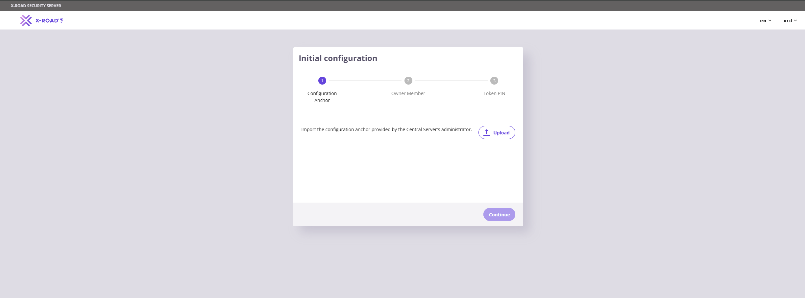

On the next page, choose the Member Class, Member Code, and set the Security Server Code. The first two values are provided with the anchor, so please use those values and set the Security Server Code yourself. At the moment, there is no strict naming convention for the testing environment.

Below is an example of the values for the test member that we will set up for this guide.

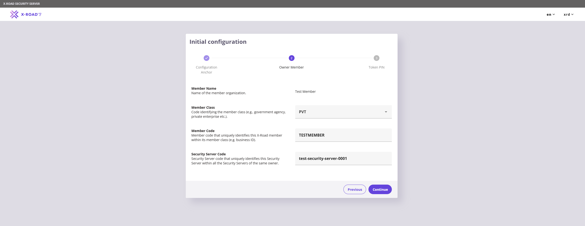

The final step here is setting a PIN for the Security Server. It must be at least 10 characters long and contain upper and lower case letters, symbols, and numbers.

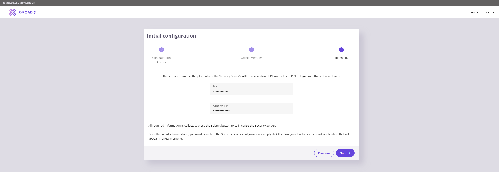

## Auth and Sign Certificates

When the initial configuration is done, go to the ``Settings`` page from the top menu and add the timestamping service. The only one available at the moment is the Test TSA.

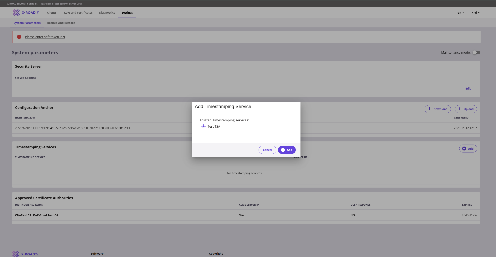

Then go to the ``Keys and Certificates`` page and unlock the soft token store by pressing the Log In button and entering the PIN. Once it is unlocked, we need to add two certificates: one for signing and one for authentication.

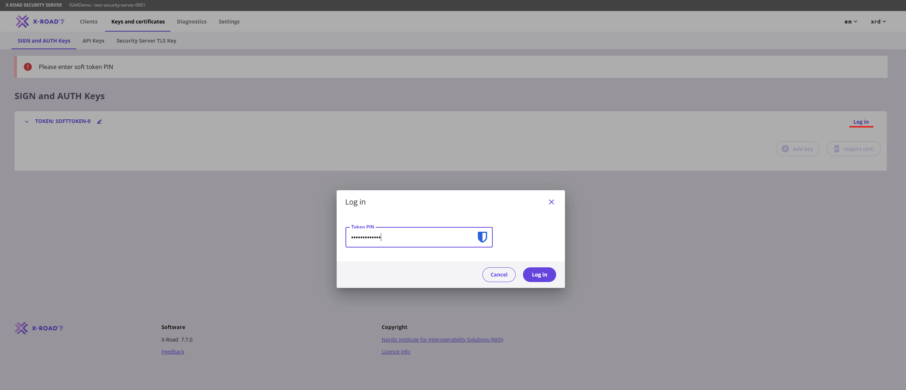

### Adding Signing key
On the ``Keys and Certificates`` page, under ``softToken-0``, click the Add Key button. On the page that opens, enter the key label (usually SIGN or AUTH) and press Continue.

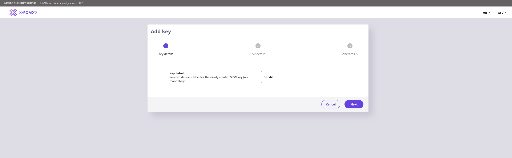

On the next page, set the key __Usage__ to ``SIGNING``, select the only available __Client__ (the member entity), and set the __Certification Service__ to Test CA.

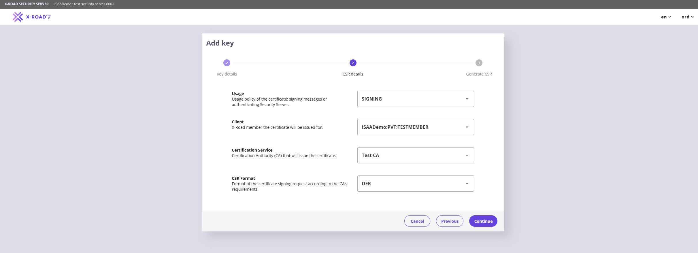

On the last form, set __Organization Name (O)__ to the same value as __Member Code__. For __Subject Alternative Name (SAN)__, choose one of the following options:
- DNS: ``security-server.dns-name.am``
- IP: ``ip-address-of-the-server``

Note: The IP or DNS name you use must expose the public ports of the Security Server (5500 and 5577).

Once done pres on __Generate CSR__ button and __Done__.

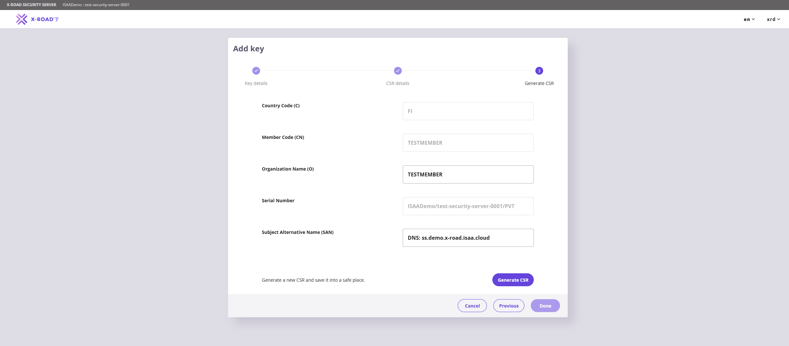

### Adding Authentication key
On the ``Keys and Certificates`` page, under ``softToken-0``, click the Add Key button. On the page that opens, enter the key label (usually SIGN or AUTH) and press Continue.

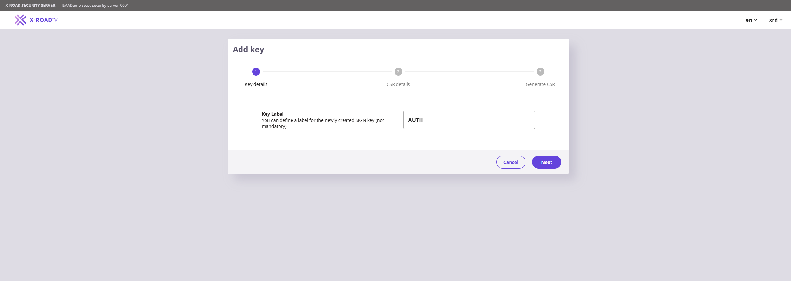

On the next page, set the key Usage to ``AUTHENTICATION``, and set the __Certification Service__ to Test CA.

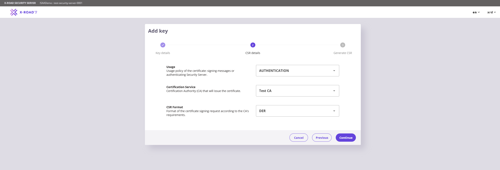

On the last form, set __Organization Name (O)__ to the same value as __Member Code__, set __Server DNS Name (CN)__ to the server’s DNS name or IP address, and set __Subject Alternative Name (SAN)__ to one of the following options:
- DNS: ``security-server.dns-name.am``
- IP: ``ip-address-of-the-server``

Note: The IP or DNS name you use must expose the public ports of the Security Server (5500 and 5577).

Once done pres on __Generate CSR__ button and __Done__.

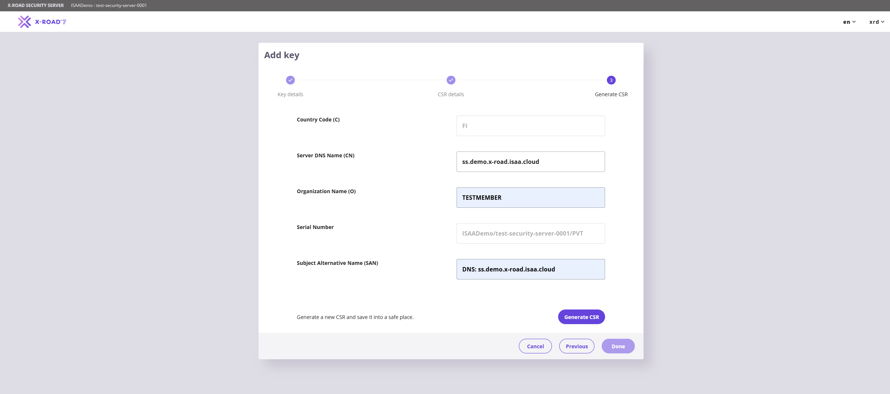

At the end of this process, you will see the following state on the ``SIGN and AUTH Keys`` page. To proceed, send the generated CSRs to x-road@isaa.am (in the same email thread as the configuration anchor request) to receive the signed certificates.

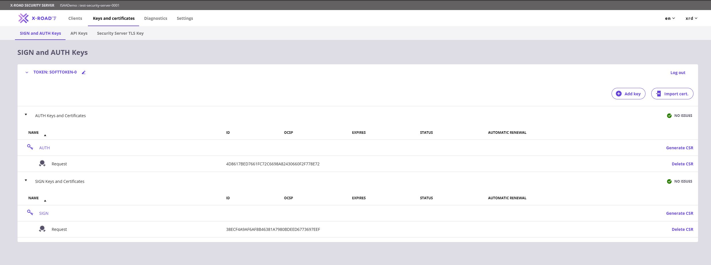

### Import and Registration of Certificates

Upon receiving the signed certificates from ISAA, go to the same ``Keys and Certificates`` page and import both certificates (one by one) by clicking the __Import Cert__ button.

After the import, the certificates page will change to this state, but we still need to enable and register the authentication certificate.

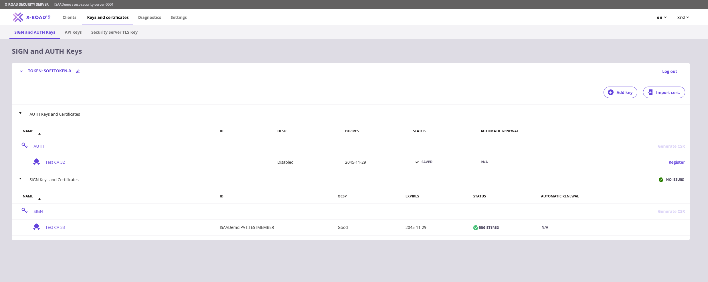

To finalize the certificate configuration, open the authentication certificate by clicking its name, and on the page that opens, click the Activate button.

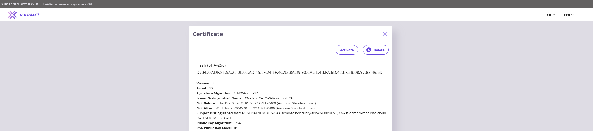

Once activated, go back and click the Register button on the left side of the authentication certificate. Enter the DNS name or IP address in the modal that opens and click the Add button.

The status of the certificate will change from ``Saved`` to ``Registration in progress``.

Please note that the certificate and client registration requests are approved manually on the Central Server. If the registration process is taking too long, please contact ISAA at x-road@isaa.am.

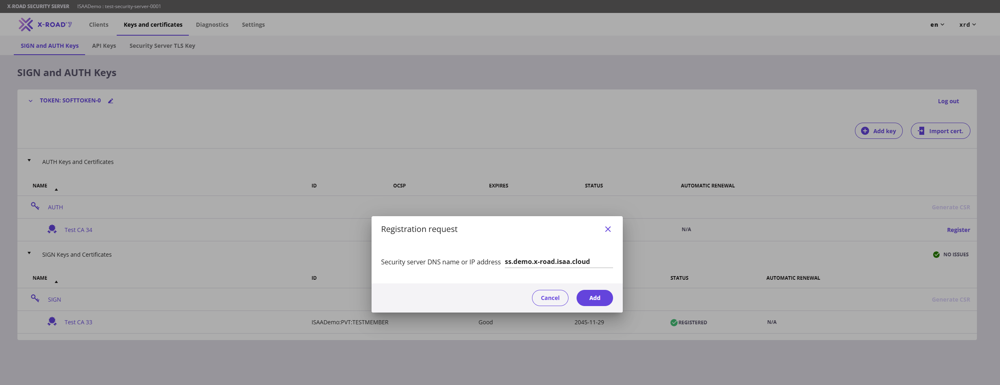

## First Subsystem

When the authentication certificate is registered, we can finally create the Security Server’s first subsystem. To do this, go to the ``Clients`` page from the top menu and click the Add Subsystem button. This will open a page where you only need to specify the subsystem code. The value can be anything, depending on the use case (from the name of the exposed service to a value that represents the purpose of the subsystem).

Keep the __Register Subsystem__ checkbox active so it will send the client registration request.

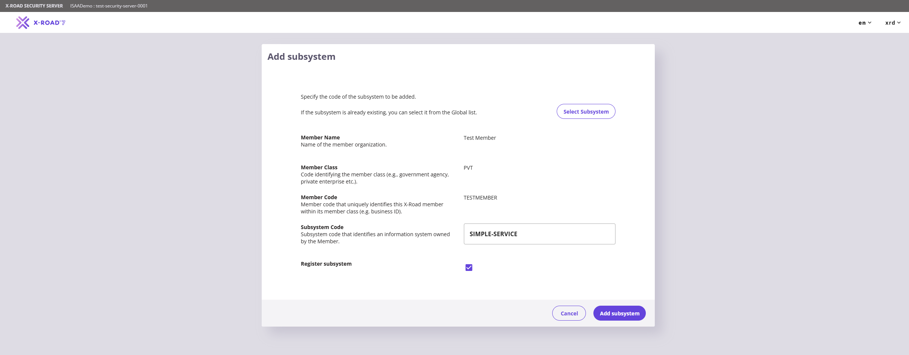

Once the client registration is approved, the subsystem is ready to be used.

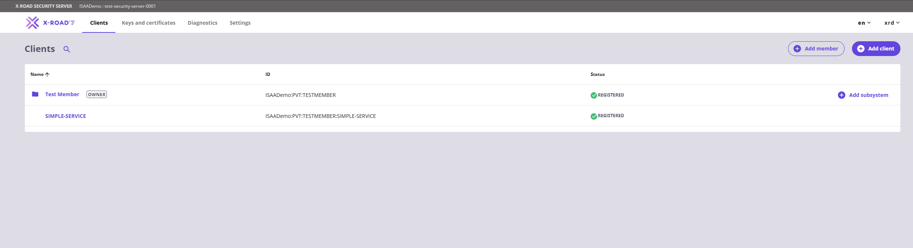